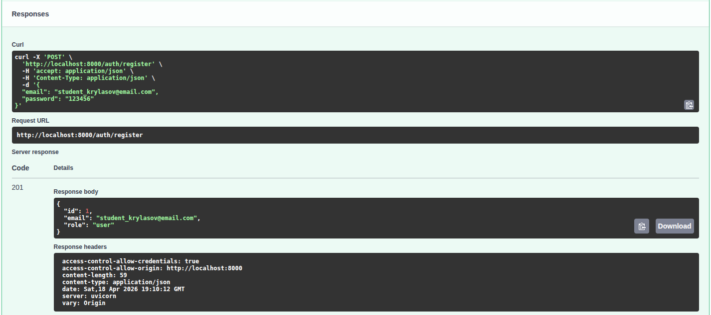
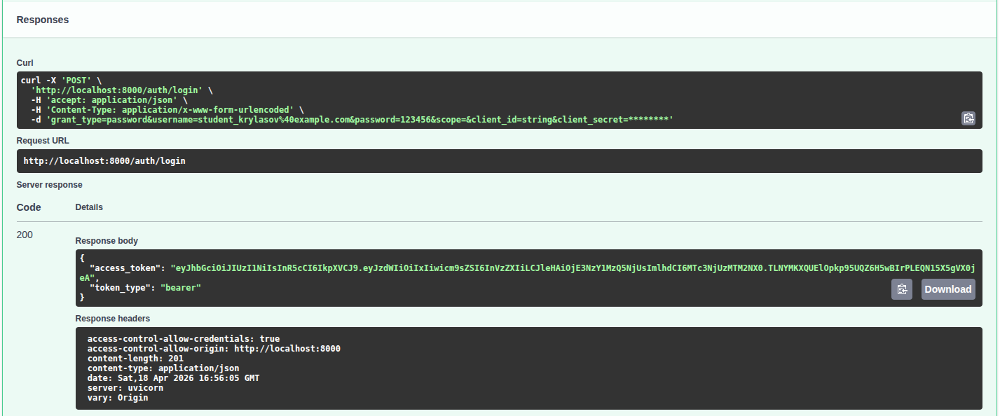
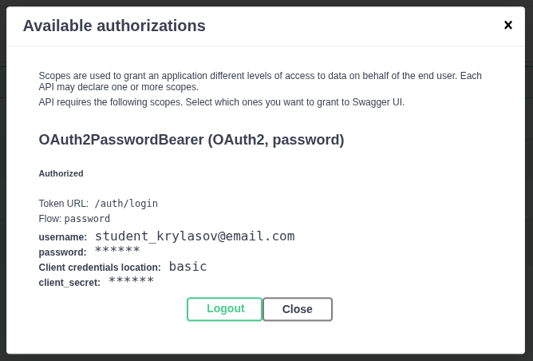
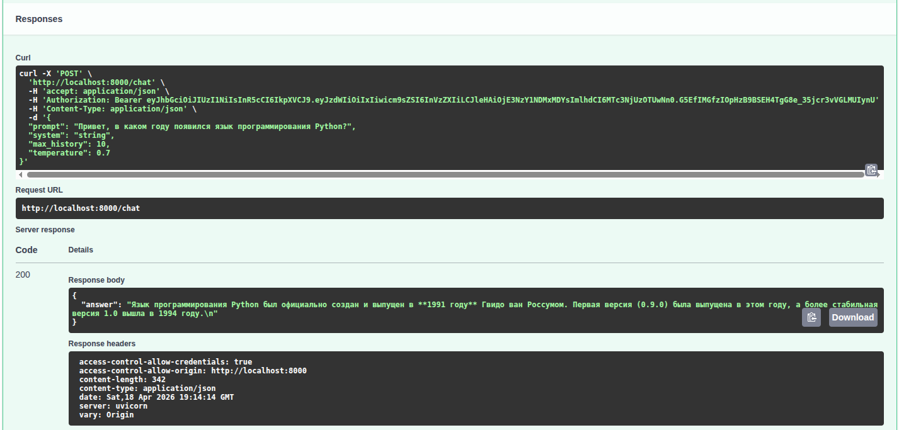
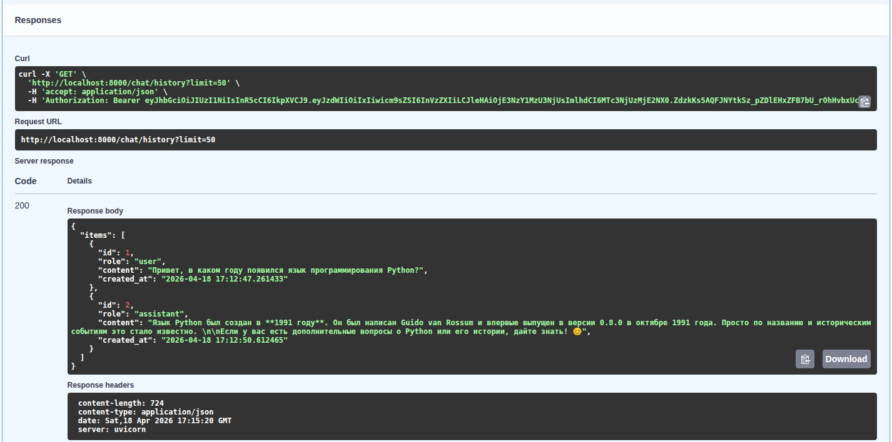
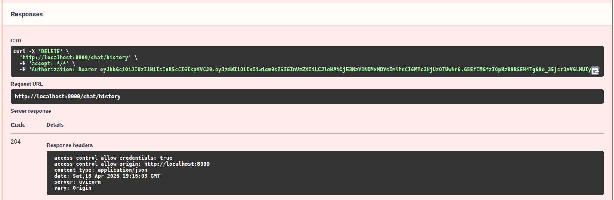

# llm-p - Secured FastAPI LLM Service

**FastAPI-приложение с JWT-аутентификацией и интеграцией LLM через OpenRouter.**

## Описание

llm-p - это серверное приложение на FastAPI, предоставляющее защищённый API для взаимодействия с большой языковой моделью LLM через сервис OpenRouter.

## Установка и запуск через uv

1. Установите uv
**Linux(Ubuntu)/MacOS:**
```bash
curl -LsSf https://astral.sh/uv/install.sh | sh 
source ~/.bashrc
```

2. Клонируйте репозиторий:
```bash
git clone https://github.com/leonid6011/llm-p_Krylasov_Leonid_M25-555
cd llm-p_Krylasov_Leonid_M25-555
```

3. Активация окружения
```bash
source .venv/bin/activate
```

4. Установка зависимостей
```bash
uv pip install -r <(uv pip compile pyproject.toml)
```

5. Настройка переменных окружения
```bash
cp .env.example .env
```
Откройте `.env` и вставьте ваш `OPENROUTER_API_KEY`.

6. Запуск приложения
```bash
uv run uvicorn app.main:app --reload --host 0.0.0.0 --port 8000
```

Swagger UI доступен по адресу: http://localhost:8000/docs

## Демонстрация работы эндпоинтов

1. Регистрация пользователя - POST /auth/register
email: `student_krylasov@email.com`



2. Логин и получение JWT - POST /auth/login



3. Авторизация в Swagger - кнопка Authorize



4. Запрос к LLM - POST /chat



5. История диалога - GET /chat/history



6. Удаление истории - DELETE /chat/history



## Структура проекта

```
llm_p/
├── pyproject.toml                 # Зависимости проекта (uv)
├── README.md                      # Описание проекта и запуск
├── .env.example                   # Пример переменных окружения
│
├── app/
│   ├── init.py
│   ├── main.py                    # Точка входа FastAPI
│   │
│   ├── core/                      # Общие компоненты и инфраструктура
│   │   ├── init.py
│   │   ├── config.py              # Конфигурация приложения (env → Settings)
│   │   ├── security.py            # JWT, хеширование паролей
│   │   └── errors.py              # Доменные исключения
│   │
│   ├── db/                        # Слой работы с БД
│   │   ├── init.py
│   │   ├── base.py                # DeclarativeBase
│   │   ├── session.py             # Async engine и sessionmaker
│   │   └── models.py              # ORM-модели (User, ChatMessage)
│   │
│   ├── schemas/                   # Pydantic-схемы (вход/выход API)
│   │   ├── init.py
│   │   ├── auth.py                # Регистрация, логин, токены
│   │   ├── user.py                # Публичная модель пользователя
│   │   └── chat.py                # Запросы и ответы LLM
│   │
│   ├── repositories/              # Репозитории (ТОЛЬКО SQL/ORM)
│   │   ├── init.py
│   │   ├── users.py               # Доступ к таблице users
│   │   └── chat_messages.py       # Доступ к истории чатов
│   │
│   ├── services/                  # Внешние сервисы
│   │   ├── init.py
│   │   └── openrouter_client.py   # Клиент OpenRouter / LLM
│   │
│   ├── usecases/                  # Бизнес-логика приложения
│   │   ├── init.py
│   │   ├── auth.py                # Регистрация, логин, профиль
│   │   └── chat.py                # Логика общения с LLM
│   │
│   └── api/                       # HTTP-слой (тонкие эндпоинты)
│       ├── init.py
│       ├── deps.py                # Dependency Injection
│       ├── routes_auth.py         # /auth/*
│       └── routes_chat.py         # /chat/*
│
└── app.db                         # SQLite база (создаётся при запуске)
```
